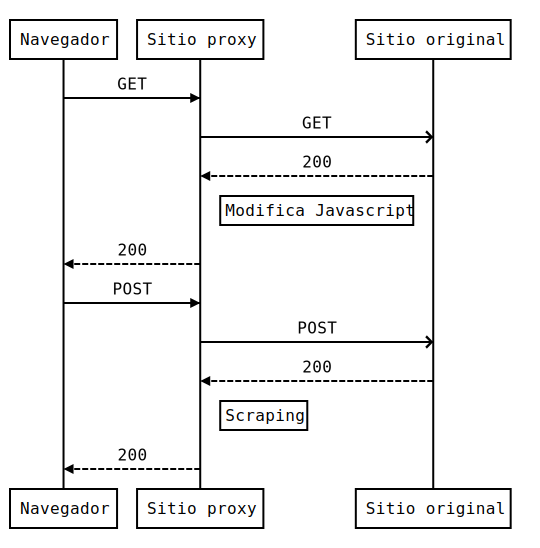

# ProxyRequests
Se utilizó la librería de python Requests para simular un proxy y modificar la funcionalidad de un sitio, a continuación se muestra algunas caráteristicas que se puede replicar.

* Sitio proxy(nuevo) http://consultapip.ml/
* Sitio original https://ofi5.mef.gob.pe/invierte/consultaPublica/consultaAvanzada
* Intercepta las peticiones para modificar el comportamiento del sitio.
* Ejecuta otras tareas mendiante scraping antes de devolver al usuario.

Diagrama creado en https://bramp.github.io/js-sequence-diagrams/
```sequence
Navegador->Sitio proxy: GET
Sitio proxy->>Sitio original: GET
Sitio original-->Sitio proxy: 200
Note right of Sitio proxy: Modifica Javascript
Sitio proxy-->Navegador: 200
Navegador->Sitio proxy: POST
Sitio proxy->>Sitio original: POST
Sitio original-->Sitio proxy: 200
Note right of Sitio proxy: Scraping
Sitio proxy-->Navegador: 200
```
